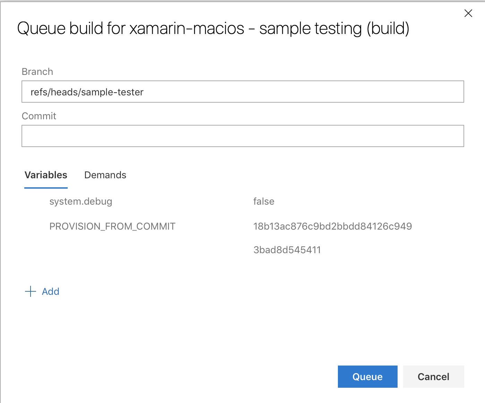

# Sample testing

These unit tests clone a series of known repositories that contain sample
projects, and build all the relevant projects in those repositories.

It is executed automatically in [Azure DevOps][1] every [Saturday][2] for the
following branches:

* master
* d16-*
* xcode*

It can also be triggered manually, but have in mind that the commit in
question must already have packages (as GitHub statuses).

It's also possible to use the sample tests from one commit, and then test with
Xamarin.iOS/Xamarin.Mac a completely different commit, by setting the
`PROVISION_FROM_COMMIT` variable to the commit that's to be tested:

The previous point is still required: the commit to provision from must have
packages.

There are two ways to run these tests locally:

* Launching xharness in server mode and execute the "Sample tests" (they're
  disabled by default).
* Executing `make` in this directory.

[1]: https://dev.azure.com/xamarin/internal/_build?definitionId=23
[1]: https://dev.azure.com/xamarin/internal/_apps/hub/ms.vss-ciworkflow.build-ci-hub?_a=edit-build-definition&id=23&view=Tab_Triggers
